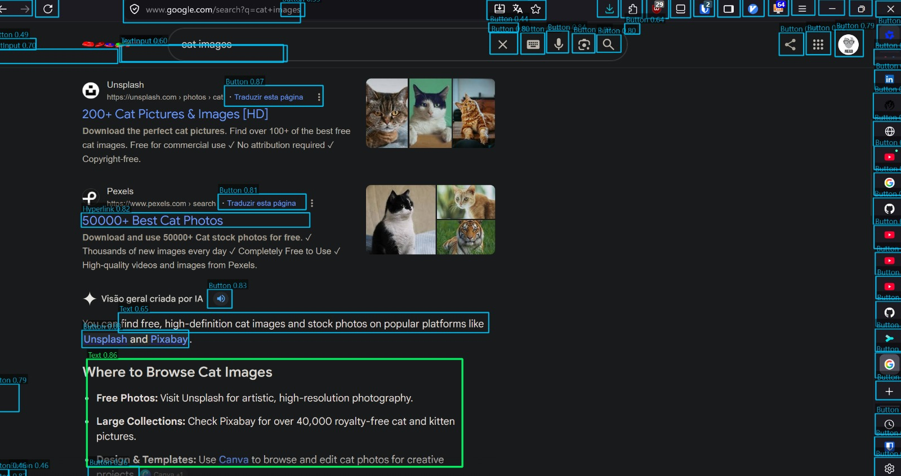

# mouse-aimbot

Local daemon that detects on-screen GUI widgets and **magnetically snaps** the OS cursor toward them. Built for imprecise pointing (eye trackers, trackpoints, low-DPI mice).



> **MVP status:** Primary monitor focus. Force-quit hotkey required — this moves your real cursor.

## Credits

This project would not exist without **[TargetFinder Toolkit](https://github.com/ahmedbenakouche/target_finder_toolkit)** by Ahmed Ben Akouche, Géry Casiez, Mathieu Nancel, and Julien Gori (MIT).

We use their published detector / UI-trained models (via PyPI) and adapted their PyQt overlay approach. The magnetic “soft aim” snap toward widgets is ours.

- **GitHub (steal with pride):** https://github.com/ahmedbenakouche/target_finder_toolkit  
- **Paper:** [TargetFinder: Detecting Widgets from Pixels on Desktop Interfaces](https://arxiv.org/abs/2607.19907) (arXiv:2607.19907)  
- **Full attribution / licenses:** [`NOTICE`](NOTICE)

## Safety

**`Ctrl+Alt+Q`** force-quits immediately.

## Setup

Needs [uv](https://docs.astral.sh/uv/).

```powershell
cd mouse-aimbot
uv sync
```

Or just `.\run.ps1` / `.\debug.ps1` — installs uv if missing, syncs, and runs.

## Run

```powershell
.\run.ps1          # snap only (no overlay) — daily driver
.\debug.ps1        # snap + on-screen detection boxes
uv run mouse-aimbot  # same as debug
uv run python -m mouse_aimbot --no-overlay
```

## What to expect

- UI-trained YOLO26 via TargetFinder (buttons, links, inputs, …)
- Cyan outlines = candidates; green = snapped target
- Magnetic pull within ~50px of a box (`mouse_aimbot/config.py`)

## License

- **mouse-aimbot code:** MIT
- **TargetFinder Toolkit:** MIT — https://github.com/ahmedbenakouche/target_finder_toolkit
- **ultralytics:** AGPL-3.0 — see `NOTICE`
